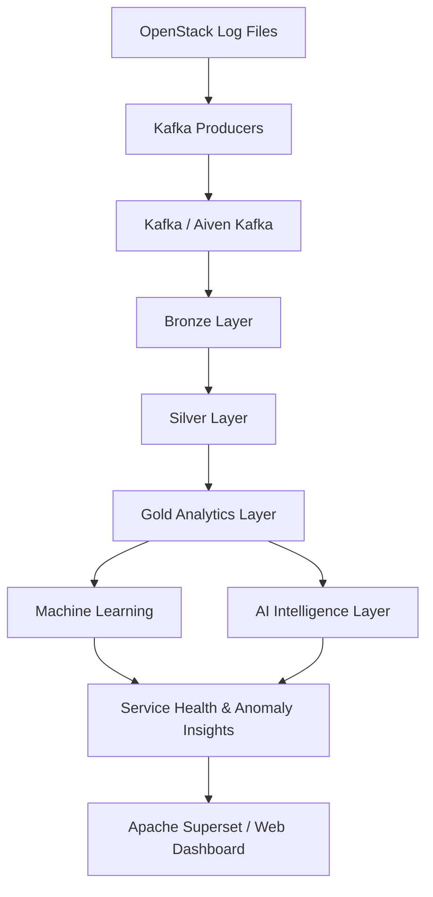

# Log Guardian AI

### End-to-End Data Engineering, Machine Learning & AIOps Platform

Log Guardian AI is an end-to-end log analytics and intelligent monitoring platform designed to process OpenStack infrastructure logs, identify anomalies, evaluate service health, and provide operational insights through an interactive dashboard.

The project combines **real-time data ingestion, distributed processing, Delta Lake, Medallion Architecture, machine learning, and AI-powered explanations** into a unified observability workflow.

---

## 🏗️ Project Architecture



---

## 🚀 Key Features

* Ingests OpenStack logs through Apache Kafka.
* Preserves raw Kafka records in the Bronze layer.
* Cleans, parses, and deduplicates logs in the Silver layer.
* Builds analytical datasets in the Gold layer.
* Performs data-quality and feature-engineering checks.
* Detects anomalous log events using machine learning.
* Predicts service health using Spark ML.
* Provides service-level risk and performance insights.
* Supports AI-generated explanations for operational issues.
* Connects dashboard APIs directly to Databricks SQL.
* Visualizes log volume, severity, anomalies, service risk, latency, and HTTP status patterns.

---

## 🧰 Technology Stack

| Area             | Technologies                                                |
| ---------------- | ----------------------------------------------------------- |
| Programming      | Python, SQL, JavaScript                                     |
| Data Ingestion   | Apache Kafka, Aiven Kafka                                   |
| Data Processing  | Apache Spark, Databricks                                    |
| Storage          | Delta Lake                                                  |
| Architecture     | Medallion Architecture                                      |
| Data Engineering | Bronze, Silver, Gold layers                                 |
| Machine Learning | Spark ML, Logistic Regression, Decision Tree, Random Forest |
| Experimentation  | MLflow / Databricks ML utilities                            |
| Analytics        | Databricks SQL                                              |
| Visualization    | Apache Superset, HTML, CSS, JavaScript                      |
| Backend          | Python API services                                         |
| Development      | VS Code, Git, GitHub, Docker                                |

---

## 🔄 Data Engineering Pipeline

### 1. Kafka Ingestion

OpenStack log files are streamed through Kafka producers into separate topics:

* `openstack-normal1`
* `openstack-normal2`
* `openstack-abnormal`

Kafka metadata is preserved to support traceability and ingestion analysis.

### 2. Bronze Layer

The Bronze layer stores the ingested Kafka records in Delta format.

It preserves:

* Raw log messages
* Kafka topic information
* Partition and offset metadata
* Event identifiers
* Ingestion timestamps
* Original event timestamps
* Source metadata

### 3. Silver Layer

The Silver layer transforms the raw records into structured, analysis-ready data.

Operations include:

* Log parsing
* Data-type standardization
* Timestamp processing
* Duplicate removal
* HTTP status categorization
* Log-level normalization
* Feature extraction
* Anomaly-label integration

### 4. Gold Layer

The Gold layer contains business-ready analytical tables, including:

* `anomaly_summary`
* `daily_summary`
* `feature_engineering_dataset`
* `http_status_summary`
* `log_level_summary`
* `ml_feature_dataset`
* `service_health`
* `service_performance`
* `service_risk_dashboard`
* `topic_summary`

These datasets support dashboard reporting, service monitoring, and machine-learning workflows.

---

## 🤖 Machine Learning

### Binary Anomaly Detection

The anomaly-detection workflow predicts whether a log event is anomalous.

The process includes:

* Feature preparation
* Missing-value handling
* Class-imbalance handling
* Model training
* Model evaluation
* Model persistence

### Service Health Prediction

The service-health workflow classifies service behavior into semantic health categories:

* **Healthy**
* **Degrading**
* **Critical**

The project uses Spark ML pipelines with:

* Categorical feature indexing
* One-hot encoding
* Numeric feature assembly
* Class weighting
* Model selection through cross-validation

The current supervised training workflow focuses on Healthy and Degrading examples because the available event-level data contains very few Critical examples.

### Early Warning Prediction

An experimental early-warning workflow aggregates service activity hourly and investigates whether the next hour may show increased operational risk.

This component is currently retained as a future enhancement because the available dataset contains very few positive warning examples.

---

## 📊 Dashboard & AI Intelligence

The platform includes a backend and frontend dashboard that provides:

* Overall log and request KPIs
* Service risk rankings
* Service health information
* Log-level distribution
* Warning and error trends
* HTTP status analysis
* Kafka topic distribution
* Latency and performance insights
* Anomaly information
* Service-level details
* Machine-learning model information
* AI-generated explanations for detected patterns

The backend can query Databricks through the Databricks SQL Connector, while the frontend consumes the dashboard API.

---

## 📁 Project Structure

```text
DE project 2/
│
├── .gitignore
├── LICENSE
├── README.md
├── requirements.txt
│
└── Log Guardian Development/
    │
    ├── app/
    │   ├── main.py
    │   ├── data_provider.py
    │   ├── ai_service.py
    │   ├── theme.py
    │   ├── test_backend.py
    │   ├── test_databricks.py
    │   ├── .env.example
    │   └── requirements.txt
    │
    ├── frontend/
    │   ├── index.html
    │   ├── app.js
    │   └── style.css
    │
    ├── kafka_stream/
    │   ├── bin/
    │   ├── data/
    │   ├── certs/
    │   ├── notebooks/
    │   ├── docker-compose.yml
    │   ├── Dockerfile
    │   └── requirements.txt
    │
    ├── databricks/
    │   ├── 00_Project_Setup.ipynb
    │   ├── 01_Kafka_Ingestion.ipynb
    │   ├── 02_Bronze_Layer.ipynb
    │   ├── 03_Silver_Transformation.ipynb
    │   ├── 04_Gold_Analytics.ipynb
    │   ├── 05_Data_Audit_and_Feature_Engineering.ipynb
    │   ├── 06_ML_Utilities.ipynb
    │   ├── 07_Binary_Anomaly_Model_Training.ipynb
    │   ├── 08_Service_Health_Prediction.ipynb
    │   └── 09_Early_Warning_Prediciton.ipynb
    │
    ├── ai/
    │   └── 10_AI_Insights_Layer.py
    │
    ├── dashboard/
    │   ├── dashboard_views.sql
    │   └── superset_embed_test.html
    │
    ├── data/
    │   ├── anomaly_labels.txt
    │   └── makeData.py
    │
    ├── docs/
    │   ├── GOLD_LAYER_REVIEW.md
    │   ├── Project Design Document.docx
    │   └── UI_AND_AI_LAYER_PLAN.md
    │
    └── scripts/
        └── gold_null_audit.py
```

---

## ⚙️ Setup

### 1. Clone the repository

```bash
git clone https://github.com/Ddevanshii10/Log-Guardian-AI---Data-Engieering-and-Data-Analytics-Project.git
cd Log-Guardian-AI---Data-Engieering-and-Data-Analytics-Project
```

### 2. Create and activate a virtual environment

On Windows:

```powershell
python -m venv .venv
.venv\Scripts\activate
```

### 3. Install dependencies

```powershell
pip install -r requirements.txt
```

For the backend application:

```powershell
pip install -r "Log Guardian Development/app/requirements.txt"
```

### 4. Configure environment variables

Create a local `.env` file inside:

```text
Log Guardian Development/app/
```

Use `.env.example` as the template.

Required Databricks configuration includes:

```text
DATABRICKS_SERVER_HOSTNAME=
DATABRICKS_HTTP_PATH=
DATABRICKS_TOKEN=
DATABRICKS_CATALOG=log-analytics
```

**Never commit `.env` files, access tokens, passwords, certificates, or private keys.**

### 5. Run the backend

From the project root, use the backend entry point according to the application's configured run command.

The backend exposes dashboard and machine-learning endpoints used by the frontend.

### 6. Open the frontend

Open:

```text
Log Guardian Development/frontend/index.html
```

For full backend integration, serve the frontend through the configured local application workflow.

---

## 🔐 Security Notes

The repository intentionally excludes sensitive and local-only files, including:

* `.env` files
* Kafka keystores
* Private keys
* Raw log files
* Local virtual environments
* Large archives
* Local Superset configuration

Use environment variables for credentials and secrets.

---

## 📌 Current Project Status

| Component                 | Status         |
| ------------------------- | -------------- |
| Kafka ingestion workflow  | Completed      |
| Bronze layer              | Completed      |
| Silver transformation     | Completed      |
| Gold analytics            | Completed      |
| Data-quality audit        | Completed      |
| Binary anomaly model      | Completed      |
| Service-health model      | Completed      |
| Databricks SQL connection | Working        |
| Backend dashboard API     | Implemented    |
| Frontend dashboard        | Implemented    |
| AI intelligence layer     | In development |
| Early-warning prediction  | Experimental   |

---

## 🔮 Future Improvements

* Improve anomaly-model validation and reduce possible feature leakage.
* Increase the number of Critical service-health examples.
* Improve early-warning label generation.
* Add real-time streaming inference.
* Integrate MLflow model registry and model versioning.
* Improve AI explanations using richer event-level evidence.
* Add automated monitoring and alerting.
* Deploy the dashboard publicly.
* Add CI/CD and automated testing.
* Add data-quality checks to the production pipeline.

---

## 👩‍💻 Author

**Devanshi Joshi**

This project was developed as a portfolio project to demonstrate practical skills in data engineering, distributed data processing, machine learning, analytics, and intelligent infrastructure monitoring.

